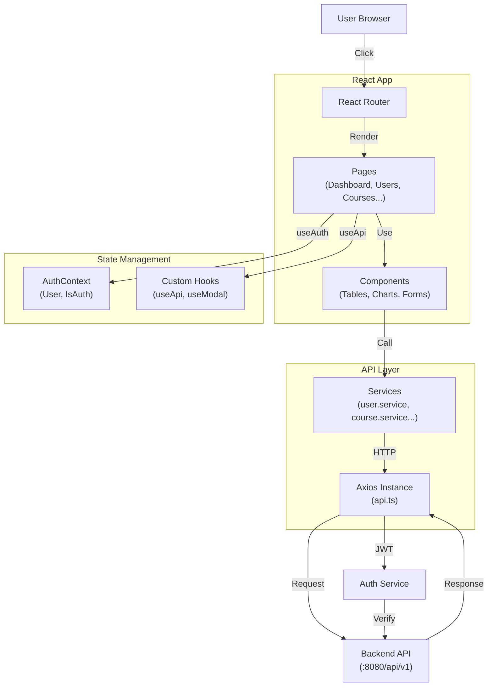
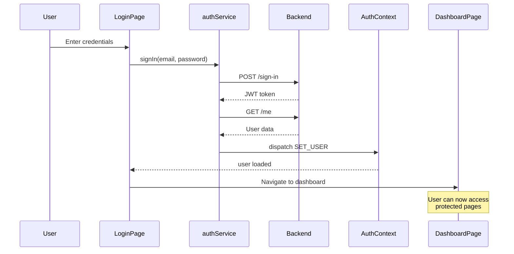

# Admin Dashboard Frontend

A modern, responsive **React + TypeScript** admin dashboard for the Code Platform. Built with **Vite**, **Tailwind CSS**, and **Recharts** for real-time analytics and management.

## Table of Contents

- [Overview](#overview)
- [Features](#features)
- [Tech Stack](#tech-stack)
- [Project Structure](#project-structure)
- [Installation & Setup](#installation--setup)
- [Environment Configuration](#environment-configuration)
- [Running Locally](#running-locally)
- [Project Architecture](#project-architecture)
- [Key Features](#key-features)
- [API Integration](#api-integration)
- [Authentication Flow](#authentication-flow)
- [Building for Production](#building-for-production)
- [Troubleshooting](#troubleshooting)

---

## Overview

This is the **admin dashboard** for managing the entire Code Platform. Admins can:
- Manage users (create, update, delete, bulk import/export)
- Create and manage courses, modules, and tests
- Monitor quiz submissions and test performance
- Track mock interviews and contest submissions
- Generate and distribute certificates
- View analytics and leaderboards
- Manage organizations and batches

---

## Features

✅ **User Management**
- View all users with pagination and search
- Create new users (role: STUDENT, ADMIN)
- Bulk import users from CSV
- Export user data
- User profile editing

✅ **Course Management**
- Create and publish courses
- Organize courses into modules and submodules
- Track enrollment and progress
- View course details and statistics

✅ **Assessment Management**
- Create tests with multiple question types
- View test submissions and scores
- Contest management with submissions
- Mock interview tracking

✅ **Analytics Dashboard**
- Real-time statistics (total users, courses, tests)
- User growth charts
- Test performance visualization
- Activity feed
- Leaderboard rankings

✅ **Certificate Management**
- Issue certificates to students
- View certificate records
- Certificate detail pages
- Download certificate history

✅ **Security & UI**
- Protected routes (role-based)
- Session management with auth context
- Responsive design (mobile, tablet, desktop)
- Dark/Light mode support
- Toast notifications

---

## Tech Stack

| Technology | Version | Purpose |
|-----------|---------|---------|
| React | 19.2.0 | UI framework |
| TypeScript | 5.9.3 | Static typing |
| Vite | 7.3.1 | Build tool & dev server |
| Tailwind CSS | 4.2.1 | Styling |
| React Router | 7.13.1 | Routing |
| Axios | 1.13.6 | HTTP client |
| Recharts | 3.7.0 | Charts & graphs |
| React Table | 8.21.3 | Data tables |
| Lucide React | 0.575.0 | Icons |
| React Hot Toast | 2.6.0 | Notifications |
| date-fns | 4.1.0 | Date utilities |

---

## Project Structure

```
front-end/
├── src/
│   ├── components/                 # Reusable UI components
│   │   ├── auth/
│   │   │   └── ProtectedRoute.tsx
│   │   ├── common/                 # Shared components
│   │   │   ├── Header.tsx
│   │   │   ├── Sidebar.tsx
│   │   │   └── ...
│   │   ├── tables/                 # Data tables
│   │   ├── modals/                 # Modal dialogs
│   │   └── forms/                  # Form components
│   ├── pages/                      # Page components
│   │   ├── LoginPage.tsx           # Authentication
│   │   ├── DashboardPage.tsx       # Main dashboard
│   │   ├── UsersPage.tsx           # User management
│   │   ├── CoursesPage.tsx         # Course management
│   │   ├── TestsPage.tsx           # Test management
│   │   ├── ContestsPage.tsx        # Contest management
│   │   ├── MockInterviewsPage.tsx  # Interview management
│   │   ├── CertificatesPage.tsx    # Certificate distribution
│   │   ├── AnalyticsPage.tsx       # Analytics & reports
│   │   ├── TestSubmissionsPage.tsx # Submission tracking
│   │   ├── SystemPage.tsx          # System settings
│   │   └── NotFoundPage.tsx        # 404 page
│   ├── services/                   # API integration
│   │   ├── api.ts                  # Axios instance
│   │   ├── user.service.ts         # User API calls
│   │   ├── course.service.ts       # Course API calls
│   │   ├── test.service.ts         # Test API calls
│   │   ├── dashboard.service.ts    # Dashboard data
│   │   ├── auth.service.ts         # Auth API calls
│   │   └── ... (other services)
│   ├── hooks/                      # Custom React hooks
│   │   ├── useApi.ts               # Fetch & loading
│   │   ├── useDebounce.ts          # Debouncing
│   │   ├── useModal.ts             # Modal state
│   │   └── index.ts
│   ├── context/                    # React Context
│   │   └── AuthContext.tsx         # Global auth state
│   ├── types/                      # TypeScript types
│   │   ├── api.types.ts            # API response types
│   │   ├── index.ts
│   │   └── ... (other types)
│   ├── config/                     # Configuration
│   │   ├── constants.ts            # App constants
│   │   └── routes.ts               # Route definitions
│   ├── layouts/                    # Layout components
│   │   ├── DashboardLayout.tsx     # Main layout
│   │   ├── AuthLayout.tsx          # Auth page layout
│   │   └── ...
│   ├── assets/                     # Images, icons
│   ├── App.tsx                     # Root component
│   ├── main.tsx                    # Entry point
│   └── index.css                   # Global styles
├── vite.config.ts                  # Vite configuration
├── tailwind.config.ts              # Tailwind configuration
├── tsconfig.json                   # TypeScript config
├── eslint.config.js                # ESLint rules
├── package.json
└── index.html
```

---

## Installation & Setup

### Prerequisites

- **Node.js** 18+ and **npm**
- **Git**
- Backend API running on `http://localhost:8080`

### Step 1: Install Dependencies

```bash
cd front-end
npm install
```

### Step 2: Create Environment File

Create a `.env.local` file:

```env
# API Configuration
VITE_API_URL=http://localhost:8080
VITE_API_KEY=your_api_key_here

# App Configuration
VITE_APP_NAME=Code Platform
VITE_APP_ENV=development
```

### Step 3: Start Development Server

```bash
npm run dev
```

The app will open at `http://localhost:5173`

---

## Environment Configuration

### Development Environment

```env
VITE_API_URL=http://localhost:8080
VITE_API_KEY=dev_api_key
VITE_APP_ENV=development
```

### Production Environment

```env
VITE_API_URL=https://api.yourdomain.com
VITE_API_KEY=prod_api_key
VITE_APP_ENV=production
```

---

## Running Locally

### Development Mode

```bash
npm run dev
```

- Hot Module Replacement (HMR) enabled
- TypeScript checking
- Development proxy for API calls

### Build for Production

```bash
npm run build
```

- Optimized bundle
- Minified code
- Source maps

### Preview Production Build

```bash
npm run preview
```

### Linting

```bash
npm run lint
```

Check code quality issues

---

## Project Architecture



---

## Key Features

### 1. Authentication

```typescript
// Login with email & password
const { user, login } = useAuth();

await login("admin@example.com", "password123");
// Returns: { user: IUser, token: string }
```

### 2. Protected Routes

```typescript
// Routes protected by role
<ProtectedRoute
  path="/dashboard"
  element={<DashboardPage />}
  requiredRole="ADMIN"
/>
```

### 3. Data Fetching with useApi Hook

```typescript
// Automatic loading/error handling
const { data: users, loading, error, refetch } = useApi(
  () => userService.getUsers({ page: 1, limit: 10 }),
  []
);

if (loading) return <Loader />;
if (error) return <Error message={error} />;
return <UserTable users={data} />;
```

### 4. Form Handling

```typescript
const handleCreateUser = async (formData: IUser) => {
  try {
    const result = await userService.createUser(formData);
    toast.success("User created successfully");
    refetch(); // Refresh list
  } catch (error) {
    toast.error("Failed to create user");
  }
};
```

### 5. Charts & Analytics

```typescript
// Recharts integration
<LineChart data={userGrowthData}>
  <CartesianGrid />
  <XAxis dataKey="month" />
  <YAxis />
  <Tooltip />
  <Line type="monotone" dataKey="users" stroke="#8884d8" />
</LineChart>
```

---

## API Integration

### Service Layer Pattern

```typescript
// backend/src/services/user.service.ts
export const userService = {
  getUsers: (params: GetUsersParams) =>
    api.get<ApiResponse<PaginatedResponse<IUser>>>("/users", { params }),

  createUser: (data: Partial<IUser>) =>
    api.post<ApiResponse<IUser>>("/users", data),

  updateUser: (id: string, data: Partial<IUser>) =>
    api.put<ApiResponse<IUser>>(`/users/${id}`, data),

  deleteUser: (id: string) =>
    api.delete<ApiResponse<object>>(`/users/${id}`),
};
```

### Using Services in Components

```typescript
// pages/UsersPage.tsx
import { userService } from "@/services";

export default function UsersPage() {
  const { data: users, loading } = useApi(
    () => userService.getUsers({ page: 1, limit: 10 }),
    []
  );

  return (
    <div>
      {loading ? <Loader /> : <UserTable users={users?.users || []} />}
    </div>
  );
}
```

---

## Authentication Flow



---

## Building for Production

### Step 1: Build

```bash
npm run build
```

Output:
```
✓ built in 45.23s

dist/
├── index.html
├── assets/
│   ├── main.js
│   ├── main.css
│   └── ...
└── ...
```

### Step 2: Deployment Options

**Option A: Netlify**
```bash
npm install -D netlify-cli
netlify deploy --prod --dir=dist
```

**Option B: Vercel**
```bash
npm install -D vercel
vercel --prod
```

**Option C: Manual (VPS/Docker)**
```bash
# Copy dist folder to your server's web directory
scp -r dist/* user@server:/var/www/code-platform/
```

### Step 3: Environment Variables

Create `.env.production`:
```env
VITE_API_URL=https://api.yourdomain.com
VITE_API_KEY=prod_key
```

---

## Troubleshooting

### Port Already in Use (5173)

```bash
# Kill process on port 5173
lsof -i :5173
kill -9 <PID>

# Or use different port
npm run dev -- --port 5174
```

### API Calls Blocked (CORS Error)

```bash
# Error: Cross-Origin Request Blocked
# Solution: Check backend ALLOWED_ORIGINS in .env

# Backend .env should include your frontend URL:
ALLOWED_ORIGINS=http://localhost:5173,https://yourdomain.com
```

### 401 Unauthorized Errors

```typescript
// Problem: Requests returning 401
// Solution: Check JWT token expiration

// The api.ts automatically redirects to /login on 401:
api.interceptors.response.use(
  (response) => response,
  (error) => {
    if (error.response?.status === 401) {
      window.location.href = "/login";
    }
    return Promise.reject(error);
  }
);
```

### Build Fails with TypeScript Errors

```bash
# Strict type checking
npm run build

# Fix issues by checking tsconfig.json
cat tsconfig.json

# Run type check
npx tsc --noEmit
```

### Module Not Found Errors

```bash
# Clear cache and reinstall
rm -rf node_modules package-lock.json
npm install

# Clear Vite cache
rm -rf .vite
npm run dev
```

### Hot Module Replacement (HMR) Not Working

```typescript
// vite.config.ts - add HMR config
export default defineConfig({
  server: {
    hmr: {
      host: 'localhost',
      port: 5173,
    },
  },
});
```

---

## Performance Optimization

✅ **Code Splitting**
- Lazy load pages with React.lazy()
- Route-based code splitting

✅ **Image Optimization**
- Use optimized images
- Implement lazy loading

✅ **Caching**
- Service workers for offline support
- Browser cache management

✅ **Bundle Analysis**
```bash
npm install -D rollup-plugin-visualizer
# Check bundle size analysis
```

---

## Development Best Practices

1. **Component Organization**
   - One component per file
   - Keep components small and focused
   - Use meaningful names

2. **API Calls**
   - Use service layer pattern
   - Implement error handling
   - Add loading states

3. **State Management**
   - Use Context for global state
   - Keep local state in components
   - Avoid prop drilling

4. **TypeScript**
   - Define types for API responses
   - Use type guards
   - Enable strict mode

---

## Contributing

1. Create a feature branch: `git checkout -b feature/your-feature`
2. Make changes and test: `npm run lint`
3. Commit: `git commit -m "Add feature description"`
4. Push: `git push origin feature/your-feature`
5. Create Pull Request

---

## License

ISC License - See LICENSE file

---

## Support

For questions or issues:
- Check documentation above
- Review browser console for errors
- Contact: support@yourdomain.com
