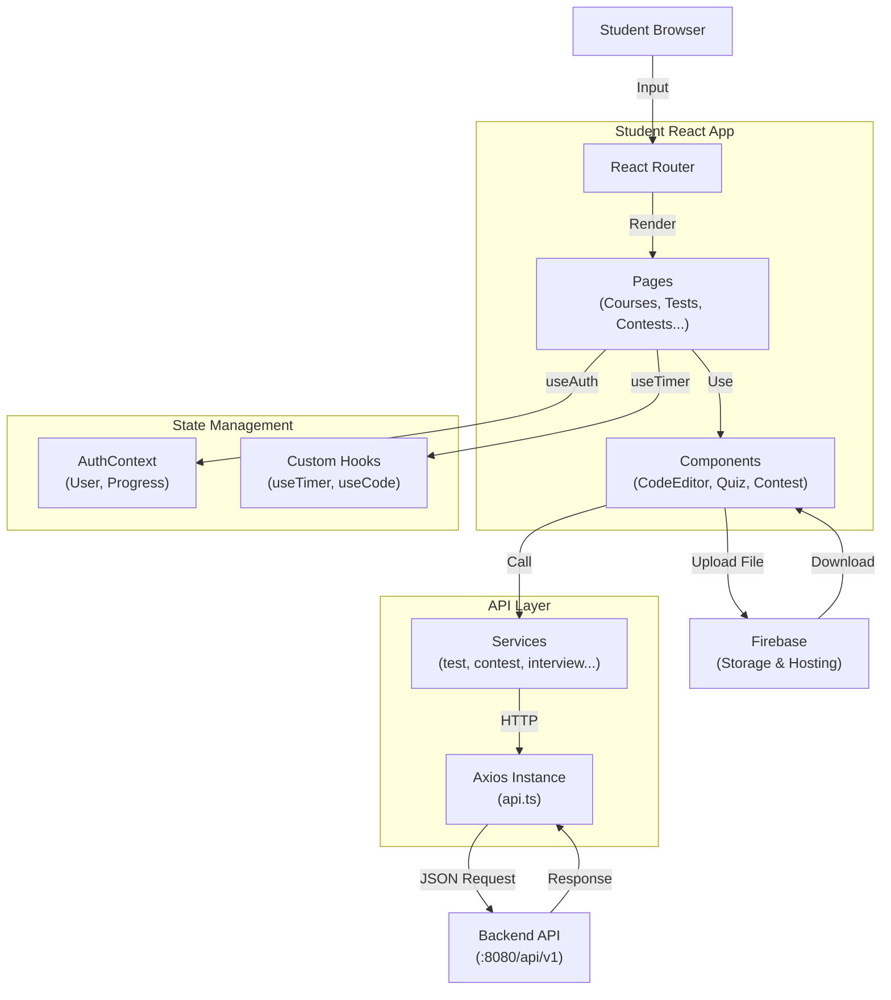

# Student Dashboard Frontend

A feature-rich **React + TypeScript** student dashboard for the Code Platform. Built with **Vite**, **Tailwind CSS**, **Monaco Editor**, and **Firebase** for a complete learning experience.

## Table of Contents

- [Overview](#overview)
- [Features](#features)
- [Tech Stack](#tech-stack)
- [Project Structure](#project-structure)
- [Installation & Setup](#installation--setup)
- [Environment Configuration](#environment-configuration)
- [Running Locally](#running-locally)
- [Project Architecture](#project-architecture)
- [Key Features Explained](#key-features-explained)
- [API Integration](#api-integration)
- [Building for Production](#building-for-production)
- [Troubleshooting](#troubleshooting)

---

## Overview

This is the **student-facing dashboard** of the Code Platform. Students can:
- View and enroll in courses
- Take tests and quizzes with immediate feedback
- Participate in time-limited contests
- Practice coding with a built-in editor
- Attempt mock interviews
- Track progress and earn certificates
- View leaderboards and achievements
- Download certificates as PDF

Perfect for learners preparing for coding interviews and competitions!

---

## Features

✅ **Course Management**
- Browse available courses
- View course modules and content
- Track learning progress
- View course statistics

✅ **Assessments & Tests**
- Take multiple-choice quizzes
- Complete coding challenges with test cases
- Real-time scoring and feedback
- View submission history
- Attempt review

✅ **Coding Practice**
- Built-in Monaco Editor (VS Code-like editor)
- Support for multiple programming languages (JavaScript, Python, Java, C++, C)
- Real-time syntax highlighting
- Quick code execution
- Test case validation

✅ **Contests**
- Real-time contest participation
- Countdown timer
- Code submission and execution
- Contest rankings and leaderboard
- Contest analytics

✅ **Mock Interviews**
- Interview question sets
- Recording practice (Firebase integration)
- Performance tracking
- Interview attempt history
- Feedback and scoring

✅ **Certificates & Achievement**
- Certificate generation and display
- Download as PDF with html2canvas
- Achievement tracking
- XP/Points system
- Badges and milestones

✅ **Analytics & Progress**
- Personal dashboard with statistics
- Progress charts and graphs
- Performance metrics
- Leaderboard rankings
- Study streak tracking

✅ **User Experience**
- Responsive design (mobile, tablet, desktop)
- Dark mode support
- Toast notifications for feedback
- Smooth animations and transitions

---

## Tech Stack

| Technology | Version | Purpose |
|-----------|---------|---------|
| React | 19.2.0 | UI framework |
| TypeScript | 5.9.3 | Static typing |
| Vite | 7.3.1 | Build tool & dev server |
| Tailwind CSS | 4.2.1 | Styling |
| React Router | 7.13.1 | Client-side routing |
| Axios | 1.13.6 | HTTP client |
| Recharts | 3.7.0 | Charts & graphs |
| Monaco Editor | 4.7.0 | Code editor |
| Firebase | 12.10.0 | File storage & auth |
| html2canvas | 1.4.1 | Screenshot for PDF |
| jsPDF | 4.2.0 | PDF generation |
| Lucide React | 0.576.0 | Icons |
| React Hot Toast | 2.6.0 | Notifications |
| date-fns | 4.1.0 | Date utilities |

---

## Project Structure

```
student_dashboard/
├── src/
│   ├── components/                 # Reusable UI components
│   │   ├── auth/
│   │   │   ├── LoginForm.tsx
│   │   │   └── SignupForm.tsx
│   │   ├── course/
│   │   │   ├── CourseCard.tsx
│   │   │   ├── ModuleList.tsx
│   │   │   └── ProgressBar.tsx
│   │   ├── assessment/
│   │   │   ├── QuestionRenderer.tsx
│   │   │   ├── CodeEditor.tsx      # Monaco Editor component
│   │   │   ├── TestResults.tsx
│   │   │   └── SubmissionHistory.tsx
│   │   ├── contest/
│   │   │   ├── ContestCard.tsx
│   │   │   ├── ContestTimer.tsx
│   │   │   ├── Leaderboard.tsx
│   │   │   └── ContestEditor.tsx
│   │   ├── interview/
│   │   │   ├── InterviewSetup.tsx
│   │   │   ├── InterviewQuestion.tsx
│   │   │   └── InterviewRecorder.tsx
│   │   ├── certificate/
│   │   │   ├── CertificateTemplate.tsx
│   │   │   └── CertificateDownload.tsx
│   │   └── common/
│   │       ├── Header.tsx
│   │       ├── Navbar.tsx
│   │       └── Footer.tsx
│   ├── pages/                      # Page components
│   │   ├── LandingPage.tsx         # Home page
│   │   ├── LoginPage.tsx           # Authentication
│   │   ├── DashboardPage.tsx       # Main dashboard
│   │   ├── CoursesPage.tsx         # Browse courses
│   │   ├── CourseDetailPage.tsx    # Course content
│   │   ├── TestsPage.tsx           # Available tests
│   │   ├── TestTakingPage.tsx      # Taking a test
│   │   ├── ContestsPage.tsx        # Browse contests
│   │   ├── ContestPage.tsx         # Active contest
│   │   ├── InterviewsPage.tsx      # Mock interviews list
│   │   ├── InterviewPage.tsx       # Taking interview
│   │   ├── CertificatesPage.tsx    # My certificates
│   │   ├── LeaderboardPage.tsx     # Global leaderboard
│   │   ├── ProfilePage.tsx         # User profile
│   │   └── NotFoundPage.tsx        # 404 page
│   ├── services/                   # API integration
│   │   ├── api.ts                  # Axios instance
│   │   ├── auth.service.ts         # Authentication
│   │   ├── course.service.ts       # Course data
│   │   ├── test.service.ts         # Test operations
│   │   ├── contest.service.ts      # Contest data
│   │   ├── interview.service.ts    # Interview data
│   │   ├── certificate.service.ts  # Certificate generation
│   │   └── firebase.service.ts     # Firebase ops
│   ├── hooks/                      # Custom React hooks
│   │   ├── useAuth.ts              # Auth management
│   │   ├── useTimer.ts             # Countdown timer
│   │   ├── useCodeEditor.ts        # Code editor state
│   │   └── index.ts
│   ├── context/                    # React Context
│   │   └── AuthContext.tsx         # Global auth state
│   ├── types/                      # TypeScript types
│   │   ├── api.types.ts            # API response types
│   │   ├── course.types.ts
│   │   ├── test.types.ts
│   │   └── index.ts
│   ├── config/                     # Configuration
│   │   ├── constants.ts            # App constants
│   │   ├── languages.ts            # Supported languages
│   │   ├── firebase.config.ts      # Firebase setup
│   │   └── routes.ts               # Route definitions
│   ├── layouts/                    # Layout components
│   │   ├── StudentLayout.tsx       # Main layout
│   │   ├── AuthLayout.tsx          # Auth page layout
│   │   └── ContestLayout.tsx       # Contest layout
│   ├── utils/                      # Utility functions
│   │   ├── certificatePdf.ts       # PDF generation
│   │   ├── codeExecutor.ts         # Code execution
│   │   ├── timerUtils.ts           # Timer helpers
│   │   └── validators.ts           # Form validation
│   ├── assets/                     # Images, icons
│   ├── landpage/                   # Landing page components
│   │   ├── Hero.tsx
│   │   ├── Features.tsx
│   │   ├── Pricing.tsx
│   │   └── FAQ.tsx
│   ├── App.tsx                     # Root component
│   ├── main.tsx                    # Entry point
│   └── index.css                   # Global styles
├── vite.config.ts                  # Vite configuration
├── tailwind.config.ts              # Tailwind configuration
├── tsconfig.json                   # TypeScript config
├── eslint.config.js                # ESLint rules
├── package.json
└── index.html
```

---

## Installation & Setup

### Prerequisites

- **Node.js** 18+ and **npm**
- **Git**
- Backend API running on `http://localhost:8080`
- **Firebase** project (for interviews & storage)

### Step 1: Install Dependencies

```bash
cd student_dashboard
npm install
```

### Step 2: Create Environment File

Create a `.env.local` file:

```env
# API Configuration
VITE_API_URL=http://localhost:8080
VITE_API_KEY=your_api_key_here

# Firebase Configuration
VITE_FIREBASE_API_KEY=your_firebase_api_key
VITE_FIREBASE_AUTH_DOMAIN=your-project.firebaseapp.com
VITE_FIREBASE_PROJECT_ID=your-project-id
VITE_FIREBASE_STORAGE_BUCKET=your-project.appspot.com
VITE_FIREBASE_MESSAGING_SENDER_ID=your_messaging_sender_id
VITE_FIREBASE_APP_ID=your_app_id

# App Configuration
VITE_APP_NAME=Code Platform - Student
VITE_APP_ENV=development
```

### Step 3: Start Development Server

```bash
npm run dev
```

The app will open at `http://localhost:5174`

---

## Environment Configuration

### Development Environment

```env
VITE_API_URL=http://localhost:8080
VITE_API_KEY=dev_api_key
VITE_APP_ENV=development
VITE_FIREBASE_PROJECT_ID=dev-project
```

### Production Environment

```env
VITE_API_URL=https://api.yourdomain.com
VITE_API_KEY=prod_api_key
VITE_APP_ENV=production
VITE_FIREBASE_PROJECT_ID=prod-project
```

---

## Running Locally

### Development Mode

```bash
npm run dev
```

- Hot Module Replacement (HMR) enabled
- TypeScript checking
- Development API proxy

### Build for Production

```bash
npm run build
```

- Optimized bundle
- Minified code
- Source maps

### Preview Production Build

```bash
npm run preview
```

### Linting

```bash
npm run lint
```

---

## Project Architecture



---

## Key Features Explained

### 1. Code Editor (Monaco)

```typescript
import { CodeEditor } from "@/components/assessment/CodeEditor";

export function TestTakingPage() {
  const [code, setCode] = useState("");
  const [language, setLanguage] = useState("javascript");

  return (
    <CodeEditor
      value={code}
      onChange={setCode}
      language={language}
      theme="vs-dark"
      height="500px"
    />
  );
}
```

Supported Languages:
- JavaScript (js)
- Python (py)
- Java (java)
- C++ (cpp)
- C (c)

### 2. Contest Timer Countdown

```typescript
import { useTimer } from "@/hooks/useTimer";

export function ContestTimer({ endTime }: { endTime: Date }) {
  const { timeLeft, isExpired } = useTimer(endTime);

  if (isExpired) return <div>Time's up!</div>;

  return <div>{Math.floor(timeLeft / 60)}:{timeLeft % 60}</div>;
}
```

### 3. Certificate Generation & Download

```typescript
import { generateCertificatePDF } from "@/utils/certificatePdf";

export function CertificateDownload({ certificate }: { certificate: ICertificate }) {
  const handleDownload = async () => {
    const pdf = await generateCertificatePDF(certificate);
    pdf.save(`certificate-${certificate.id}.pdf`);
  };

  return <button onClick={handleDownload}>Download PDF</button>;
}
```

### 4. Test Submission Flow

```typescript
export function TestTakingPage() {
  const [answers, setAnswers] = useState<Record<string, string | number>>({});
  
  const handleSubmit = async () => {
    const response = await testService.submitTest(testId, {
      answers,
      timeSpent: Date.now() - startTime,
    });
    
    toast.success("Test submitted!");
    navigate("/results/" + response.data.data.submissionId);
  };

  return (
    <>
      {questions.map((q) => (
        <Question key={q.id} question={q} onChange={(ans) => setAnswers({...answers, [q.id]: ans})} />
      ))}
      <button onClick={handleSubmit}>Submit Test</button>
    </>
  );
}
```

### 5. Real-time Leaderboard

```typescript
export function Leaderboard() {
  const { data: rankings, loading } = useApi(
    () => contestService.getLeaderboard(contestId),
    [contestId]
  );

  return (
    <BarChart data={rankings}>
      <CartesianGrid />
      <XAxis dataKey="rank" />
      <YAxis />
      <Bar dataKey="score" fill="#8884d8" />
    </BarChart>
  );
}
```

---

## API Integration

### Service Pattern for Tests

```typescript
// src/services/test.service.ts
export const testService = {
  getAvailableTests: () =>
    api.get("/tests", { params: { student: true } }),

  getTestById: (testId: string) =>
    api.get(`/tests/${testId}`),

  getTestQuestions: (testId: string) =>
    api.get(`/tests/${testId}/questions`),

  submitTest: (testId: string, submission: ITestSubmission) =>
    api.post(`/tests/${testId}/submit`, submission),

  getSubmissionResult: (submissionId: string) =>
    api.get(`/tests/submissions/${submissionId}`),
};
```

### Service Pattern for Contests

```typescript
export const contestService = {
  getActiveContests: () =>
    api.get("/contests?status=active"),

  getContestDetails: (contestId: string) =>
    api.get(`/contests/${contestId}`),

  submitSolution: (contestId: string, code: string, language: string) =>
    api.post(`/contests/${contestId}/submit`, { code, language }),

  getLeaderboard: (contestId: string) =>
    api.get(`/contests/${contestId}/leaderboard`),
};
```

---

## Firebase Integration

### Setup Firebase:

```typescript
// src/config/firebase.config.ts
import { initializeApp } from "firebase/app";
import { getStorage } from "firebase/storage";
import { getAuth } from "firebase/auth";

const firebaseConfig = {
  apiKey: import.meta.env.VITE_FIREBASE_API_KEY,
  authDomain: import.meta.env.VITE_FIREBASE_AUTH_DOMAIN,
  projectId: import.meta.env.VITE_FIREBASE_PROJECT_ID,
  storageBucket: import.meta.env.VITE_FIREBASE_STORAGE_BUCKET,
  messagingSenderId: import.meta.env.VITE_FIREBASE_MESSAGING_SENDER_ID,
  appId: import.meta.env.VITE_FIREBASE_APP_ID,
};

export const app = initializeApp(firebaseConfig);
export const storage = getStorage(app);
export const auth = getAuth(app);
```

### Upload Interview Recording:

```typescript
import { ref, uploadBytes } from "firebase/storage";
import { storage } from "@/config/firebase.config";

export async function uploadInterviewRecording(
  attemptId: string,
  videoBlob: Blob
) {
  const storageRef = ref(storage, `interviews/${attemptId}/video.mp4`);
  await uploadBytes(storageRef, videoBlob);
  return storageRef;
}
```

---

## Building for Production

### Step 1: Build

```bash
npm run build
```

Output:
```
✓ built in 42.15s

dist/
├── index.html
├── assets/
│   ├── main.js
│   ├── main.css
│   └── ...
└── ...
```

### Step 2: Deployment Options

**Option A: Firebase Hosting**
```bash
npm install -g firebase-tools
firebase login
firebase init hosting
npm run build
firebase deploy
```

**Option B: Netlify**
```bash
netlify deploy --prod --dir=dist
```

**Option C: Vercel**
```bash
vercel --prod
```

---

## Quiz Question Types

The dashboard supports:

1. **Multiple Choice (MCQ)**
   - Single correct answer
   - Multiple correct answers

2. **Coding Challenges**
   - Write code to solve problems
   - Test cases validation
   - Real-time execution feedback

3. **Behavioral Interview Questions**
   - Open-ended questions
   - Recording responses
   - AI-based evaluation (optional)

---

## Performance Optimization

✅ **Code Splitting**
```typescript
// Lazy load heavy components
const CodeEditor = lazy(() => import("@monaco-editor/react"));
const PdfExport = lazy(() => import("html2canvas"));
```

✅ **Image & Asset Optimization**
- Compress images before upload
- Use Firebase CDN

✅ **Caching**
- Cache test questions locally
- Cache course modules

✅ **Monitor Bundle Size**
```bash
npm run build -- --reporting
```

---

## Troubleshooting

### Monaco Editor Not Loading

```typescript
// Ensure VITE_API_URL is correctly set
// Monaco requires proper origin policy
// Add to vite.config.ts:

server: {
  headers: {
    'Cross-Origin-Opener-Policy': 'same-origin-allow-popups',
    'Cross-Origin-Embedder-Policy': 'require-corp',
  },
}
```

### Firebase Upload Fails

```bash
# Error: Missing Firebase config
# Solution: Check .env.local has all VITE_FIREBASE_* variables
# Verify Firebase Project ID matches

# Test connection:
firebase init
firebase projects:list
```

### Code Execution Timeout

```typescript
// Backend timeout limit (typically 5-10 seconds)
// For long-running code, add timeout handling:

const runCode = async (code: string) => {
  try {
    const result = await executeCode(code, timeout: 10000);
  } catch (error) {
    if (error.code === 'TIMEOUT') {
      toast.error('Code execution timed out');
    }
  }
};
```

### Certificate PDF Generation Issues

```typescript
// html2canvas issues on certain fonts
// Solution: Use system fonts or web-safe fonts

// In CSS:
font-family: -apple-system, BlinkMacSystemFont, 'Segoe UI', sans-serif;
```

### Contest Timer Not Syncing

```typescript
// Problem: Local timer drift
// Solution: Sync with server time periodically

const useTimer = (serverEndTime: Date) => {
  useEffect(() => {
    const interval = setInterval(async () => {
      const serverTime = await getServerTime();
      const newTimeLeft = serverEndTime.getTime() - serverTime.getTime();
      setTimeLeft(newTimeLeft);
    }, 5000); // Sync every 5 seconds
    
    return () => clearInterval(interval);
  }, []);
};
```

---

## Best Practices

1. **Test Submission**
   - Validate all answers before submission
   - Show confirmation dialog
   - Save auto-submitted attempts

2. **Code Editor**
   - Show syntax errors in real-time
   - Test code before final submission
   - Save drafts locally

3. **Contest Experience**
   - Warn users when time is running low
   - Prevent accidental navigation with unsaved code
   - Show submission confirmation

4. **Mobile Optimization**
   - Stack layouts vertically on small screens
   - Use touch-friendly buttons
   - Responsive editor sizing

---

## Contributing

1. Create a feature branch: `git checkout -b feature/your-feature`
2. Make changes and test: `npm run lint`
3. Commit: `git commit -m "Add feature description"`
4. Push: `git push origin feature/your-feature`
5. Create Pull Request

---

## License

ISC License - See LICENSE file

---

## Support

For questions or issues:
- Check documentation above
- Review browser console for errors
- Contact: support@yourdomain.com
